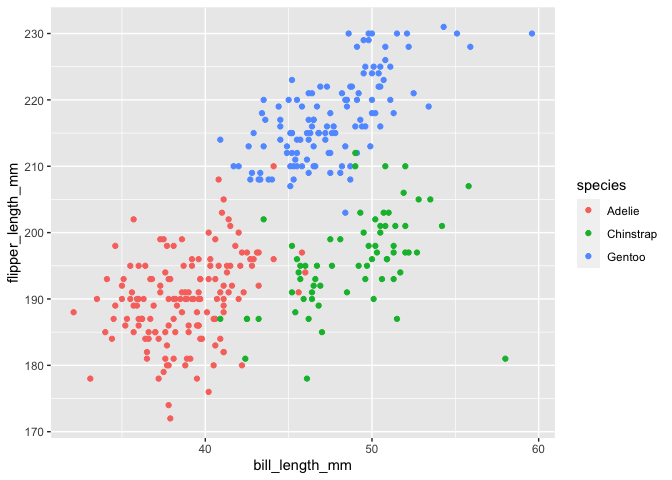

p8105_hw1_ei2262
================

# Problem 1

## Description of `penguins` Dataset

    ## # A tibble: 344 × 8
    ##    species island    bill_length_mm bill_depth_mm flipper_…¹ body_…² sex    year
    ##    <fct>   <fct>              <dbl>         <dbl>      <int>   <int> <fct> <int>
    ##  1 Adelie  Torgersen           39.1          18.7        181    3750 male   2007
    ##  2 Adelie  Torgersen           39.5          17.4        186    3800 fema…  2007
    ##  3 Adelie  Torgersen           40.3          18          195    3250 fema…  2007
    ##  4 Adelie  Torgersen           NA            NA           NA      NA <NA>   2007
    ##  5 Adelie  Torgersen           36.7          19.3        193    3450 fema…  2007
    ##  6 Adelie  Torgersen           39.3          20.6        190    3650 male   2007
    ##  7 Adelie  Torgersen           38.9          17.8        181    3625 fema…  2007
    ##  8 Adelie  Torgersen           39.2          19.6        195    4675 male   2007
    ##  9 Adelie  Torgersen           34.1          18.1        193    3475 <NA>   2007
    ## 10 Adelie  Torgersen           42            20.2        190    4250 <NA>   2007
    ## # … with 334 more rows, and abbreviated variable names ¹​flipper_length_mm,
    ## #   ²​body_mass_g

The dataset `penguins` focuses on the following descriptive
characteristics of penguins:

1.  Type of species
2.  Island of origin
3.  Bill length of penguin(in mm)
4.  Bill depth of penguin(in mm)
5.  Flipper length of penguin(in mm)
6.  Body mass of penguin(in g)
7.  Sex of penguin
8.  Year

The dataset contains 344 rows and 8 columns. The mean flipper length is
200.92 mm.

## Scatterplot

The following is a scatterplot with `bill_length_mm` on the x-axis and
`flipper_length_mm`on the y-axis. The dataset is color coordinated based
on the variable `species`.

    ## Warning: Removed 2 rows containing missing values (geom_point).

<!-- -->

The scatterplot was exported as a pdf to my project directory using
`ggsave`. It was named “penguinsplot.”

# Problem 2

``` r
hw_df = tibble(
  vec_numeric = rnorm(n = 10),
  vec_logical = vec_numeric > 0,
  vec_character = c("d","s","h","o","m","e","w","o","r","k"),
  vec_factor = factor(c("high", "med","high","high","high","low","low","low","med","med"))
)

mean(pull(hw_df, vec_numeric))
```

    ## [1] 0.08680869

``` r
mean(pull(hw_df, vec_logical))
```

    ## [1] 0.6

``` r
mean(pull(hw_df, vec_character))
```

    ## Warning in mean.default(pull(hw_df, vec_character)): argument is not numeric or
    ## logical: returning NA

    ## [1] NA

``` r
mean(pull(hw_df, vec_factor))
```

    ## Warning in mean.default(pull(hw_df, vec_factor)): argument is not numeric or
    ## logical: returning NA

    ## [1] NA

After creating the dataframe, I tried calculating the mean of each
variable. I was able to calculate the mean for two variables:
*vec_numeric* and *vec_logical*. VWhen I calculated the mean for
variables *vec_character* and *vec_factor*, I got an output of *NA*.

# Applying `as.numeric`

``` r
logical_num = as.numeric(pull(hw_df, vec_logical))
mean(logical_num)

character_num = as.numeric(pull(hw_df, vec_character))
mean(character_num)

factor_num = as.numeric(pull(hw_df, vec_factor))
mean(factor_num)
```

After applying the `as.numeric` function to the logical, character, and
factor variables, I was able to calculate the mean of the logical and
factor variables. The character variable produces *NA* as the output.  
A logical vector has two possible levels, true or false. Therefore, when
`as.numeric` is applied to a logical vector, it would be converted the
observations to a 0 (false) or to a 1 (true). 0 and 1 are both numeric
values and can be used to calculate a mean value.  
The factor vector created in the dataframe has 3 levels, high, medium,
and low. When `as.numeric` is applied to it, the variable will convert
each level to a corresponding number, such as 1 for high, 2 for medium,
and 3 for low. Numbers 1 - 3 can then be used to calculate a mean value.

This helps explain what happens when I am trying to take the mean and
explains why I was unable to get a mean value before applying the
`as.numeric` function to the vectors I created.
